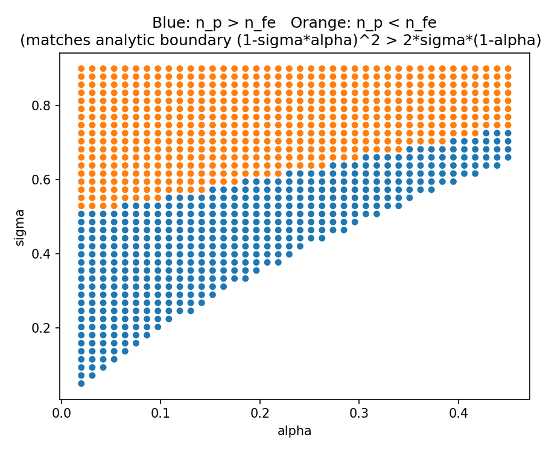
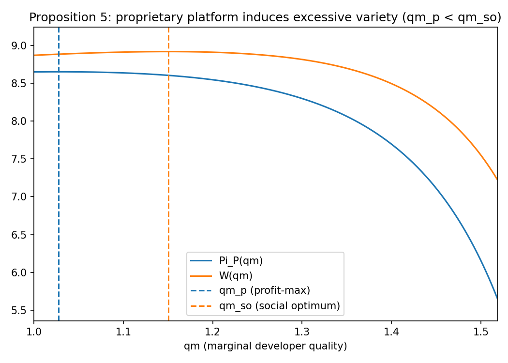
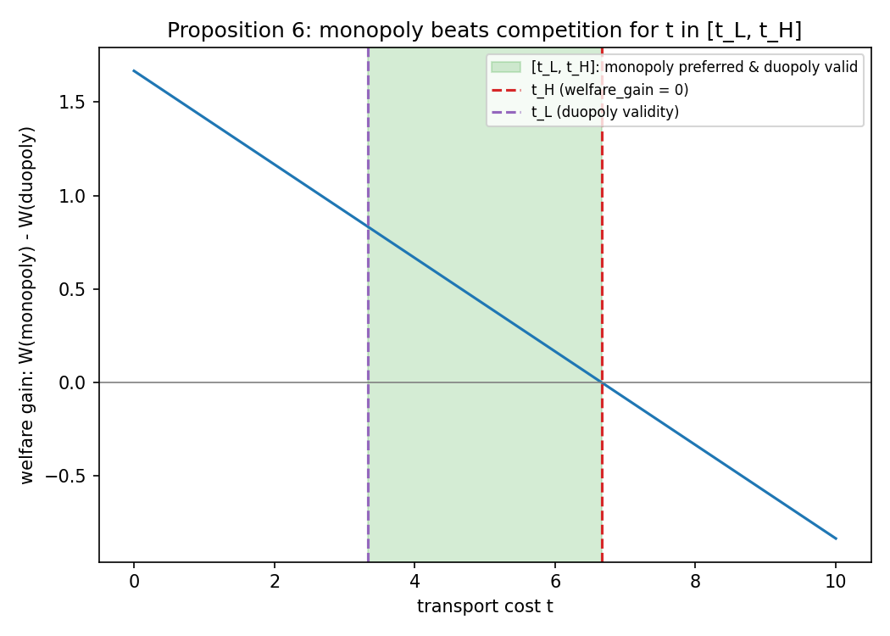

# Social Efficiency in Two-Sided Platforms

Numerical reproduction of the core comparative-statics results from:

> Andrei Hagiu, "Proprietary vs. Open Two-Sided Platforms and Social
> Efficiency," Harvard Business School Working Paper 07-095 (2006/2007).

The paper shows that a profit-maximizing ("proprietary") two-sided platform
can be *more* socially efficient than an open, free-entry platform — and
that platform competition can be *less* socially efficient than a monopoly
platform — because proprietary pricing partially internalizes positive
indirect network externalities and competitive effects between developers
that open platforms and platform competition leave uninternalized. This
repo numerically verifies Propositions 4, 5, and 6 of the paper.

See [`writeup.md`](writeup.md) for a full summary of what was reproduced and
what each figure shows.

## What's reproduced

- **Proposition 4** — both a proprietary platform and an open platform
  under-provide product variety/user adoption relative to the social
  optimum; the proprietary platform can nonetheless exceed the open
  platform's variety *and* welfare for some parameters.
- **Proposition 5** — with vertically differentiated developers, a
  proprietary platform can induce *excessive* product variety.
- **Proposition 6** — platform competition can be *less* socially efficient
  than a single monopoly platform, for a non-empty range of Hotelling
  transport costs.

## Repo structure

```
social-efficiency-in-two-sided-platforms/
├── src/
│   ├── model.py          # pi(n), u(n), V(n) closed forms (Examples 1 & 2)
│   ├── equilibria.py     # solvers for n_p, n_fe, n_so
│   ├── vertical_diff.py  # Proposition 5
│   ├── competition.py    # Proposition 6
│   ├── welfare.py        # W(n, theta_m)
│   └── prop4.py          # Proposition 4 helpers
├── notebooks/results.ipynb  # all plots + sanity checks, with markdown commentary
├── figures/               # exported PNGs
├── tests/                 # pytest unit tests (22 tests)
└── writeup.md             # what was reproduced, what each figure shows, edge cases
```

## Running it

```bash
pip install -r requirements.txt
pytest tests/ -v
jupyter notebook notebooks/results.ipynb
```

## Key plots

**Proposition 4(ii): the `n_p > n_fe` boundary matches the analytic condition exactly (975/975 grid points)**



**Proposition 5: proprietary platform induces excessive variety (`qm_p < qm_so`)**



**Proposition 6: monopoly beats platform competition for `t` in `[t_L, t_H]`**


